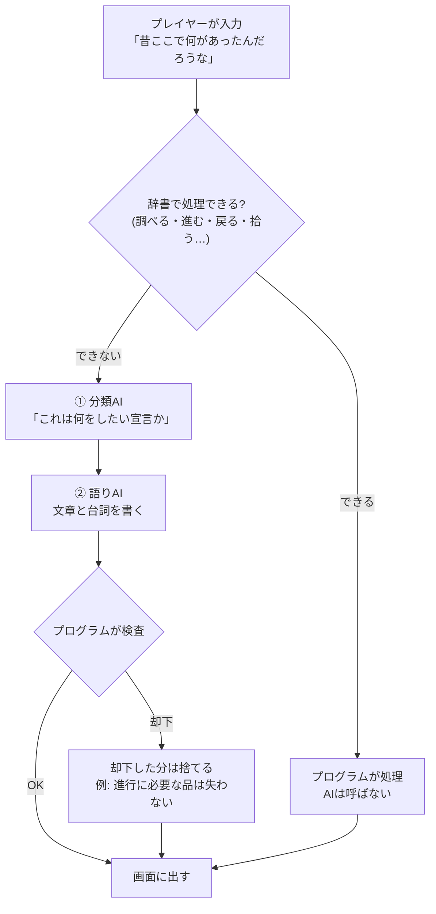

# mock2はAIをどう使っているか(やさしい版)

2026-08-20 作成。読む人: 作者(コードを読まない前提)。
書いてあることはすべて実コードで確認済み。推測は「未確認」と明記する。

---

## 最初に、3行だけ

1. **AIは「語り手」であって「審判」ではない。** 話の文章を書くのはAI、進行を決めるのはプログラム。
2. **AIに渡しているのは、日本語の手紙1通。** JSONだのプログラムだのではなく、ふつうの日本語の文書。
3. **AIから受け取るのは、記入済みの申請用紙。** 欄が決まっていて、その形を「スキーマ」と呼ぶ。

以下、この3つを順に開く。

---

## 1. そもそもAIは何をしているのか

mock2の1手番は、ざっくり2つの仕事に分かれている。

| 仕事 | 誰がやるか | 例 |
|---|---|---|
| **文章を書く** | AI | 「坑道の奥から、湿った風が吹き上がってくる。」 |
| **何が起きたかを決める** | プログラム | 木の札の秘密が開いた。HPは減っていない。シーン2へ進んだ |

**この線引きが、mock2の設計の核心。**

なぜ分けているのか。AIに「何が起きたか」を決めさせると、シナリオに無いものを勝手に作る。存在しない通路を開ける、まだ調べていない秘密の答えを喋る、拾えない品を渡す。実際にそれで壊れた記録がコードのコメントに何度も残っている。

だから**AIは文章だけを書き、内容の可否はプログラムが検査する**。

---

## 2. AIの使い方は3段階ある(画面のボタンで切り替わる)

| モード | 何が起きるか | AIを呼ぶ回数 |
|---|---|---|
| `scripted` | 全部プログラム。文章も定型文。 | **0回** |
| `hybrid`(既定) | 移動と調査はプログラム、会話と自由入力だけAI | 手番によって0〜2回 |
| `llm` | 全部AI(昔の作り) | 毎手番 |

**`scripted`はAIを1回も呼ばない。** これは「契約」としてコードに書いてあり、検査(`npm test`)で「呼び出し0件」を毎回確かめている。ゲームブック側と同じ条件で進行を確かめるためのモード。

**`hybrid`が普段のモード。** 「木の札を調べる」「進む」はプログラムが処理してAIを呼ばない。「昔ここで何があったんだろうな」のような、辞書に無い自由な言葉だけAIへ行く。

---

## 3. 1手番の流れ



**AIを2回呼んでいる**のがポイント。1回目は小さな仕分け係、2回目が本番の語り手。

実測した大きさ(章1シーン1)。

```
① 分類AI   手紙 657文字   / 返事の上限 80トークン   (おおよそ日本語で60〜80字)
② 語りAI   手紙 4,446文字 / 返事の上限 1,000トークン (おおよそ日本語で700〜1,000字)
```

「トークン」はAIが文章を数える単位。日本語なら、おおむね1文字〜数文字で1つ。

分類係を先に置く理由は、語りAIに「これは移動の宣言だ」と判断させないため。移動の判断はプログラムの仕事なので、分類だけを切り出して渡している。

---

## 4. AIに渡している「手紙」の中身

**プログラムっぽい形式ではない。ふつうの日本語の文書。** 実物の抜粋(章1シーン1)。

```
あなたはソロTRPGのゲームマスター。名はダイス先輩。ゲームマスターである。確定した結果を説明する。
プレイヤーを優しく案内する。たまにギャグを言う。語尾が上がる。
一人称は「私」で統一せよ。「〜わ」「〜のよ」等の女性的な語尾は使わない。
日本語の「である調」(だ・である。ですます調は禁止)で語る。地の文は3文以内、合計80字以内。
良い例:「廊下は暗くて静かだ。足音がよく響く。」
悪い例:「薄明の廊下に、沈黙を湛えた気配が漂っている。」
ミステリー / ロー・ファンタジー。静かで神秘的、少し切ない。
使ってはならない語の例: 懐中電灯、電灯、モーター、エンジン、電池、メートル。

# 依頼(プレイヤーの目的)
灯りの正体を確かめ、坑道が使えるか村に報告する(依頼人:村の顔役マイラ・ヴェイン)

# 同行者(あなたが演じる)。全員、プレイヤーと同じ情報しか知らない
- リディア(member_1): 遺工に詳しい斥候である。物事を慎重に考える。皮肉をよく言う。
  一人称は「わたし」で統一せよ。プレイヤーを二人称で呼ぶ時は「あなた」で統一せよ。
- ガレス(member_2): 無口な戦士である。言葉を少なく話す。実用的な動きだけをする。
  一人称は「俺」で統一せよ。プレイヤーを二人称で呼ぶ時は「お前」で統一せよ。

# ルール
- 不確実な行動には判定を要求する。難易度(DC)はd20に対し 7=易 12=並 17=難。
- 未開示の真相を勝手に作らない。判定成功時にシステムから情報が渡される。
- 情景の小物(瓦礫、朽ちた道具等)は自由に肉付けしてよい。
  ただし新たな通路・出口・人物・入手可能な品を作ってはならない。

# 現在のシーン(1/7)
古いレールと薄汚れた木の札がある。奥の方から何かしらの金属音がかすかに聞こえる。

# プレイヤー状態(システム管理。あなたは変更できない。反応的参照のみ)
HP: 10/10 — 数値を語りに出すな。残量の感覚をトーンに反映するのはよい
所持品: ランタン、ロープ、ナイフ

# 開示済みの情報(これ以外の真相をあなたは知らない。捏造禁止)
(まだなし)
```

見出しの内容の出どころは、ほぼ全部**作者が書いたデータ**。

| 手紙の見出し | どこから来るか |
|---|---|
| 文体・GMの人格 | `campaign.json` の `style` と GM設定 |
| 依頼 | 章データの `quest` |
| 同行者の性格・口調 | `campaign.json` の `companions` |
| 現在のシーン | 章データの `brief` |
| 演出指示(ト書き) | 章データの `direction` |
| ルール・応答の形 | **コード**(エンジンの動作契約なので固定) |

つまり**TASで文体や演出指示を書き換えると、AIへの手紙が変わる**。ここが作者の操縦席。

### 手紙の並び順には理由がある

前半 = 毎ターン変わらないもの(文体・依頼・同行者・ルール)。
後半 = 毎ターン変わるもの(経緯・シーン・状態)。

変わらない部分を先頭に固めておくと、AIが前回の計算結果を再利用できる。ローカルのAIで**31秒 → 3秒**になった実測がコードに残っている。

---

## 5. 「スキーマ」とは何か

**AIに返してもらう用紙の、欄の名前と形の決まり**のこと。中身の値ではなく、**入れ物の形**。

手紙の「# ルール」の最後に、こういう1行が入っている。これがスキーマ。

```
応答は必ず次のJSONのみ。前置きやコードフェンス禁止:
{"narration":"地の文",
 "companion":{"who":"member_1 または member_2","say":"その一言","aside":false} または null,
 "check":{"reason":"何の判定か","difficulty":8,"targetEntity":"…","actor":"…"} または null,
 "state_updates":{"hp_delta":0,"add_items":[],"remove_items":[]} または null,
 "engage_enemy":false,"scene_complete":false,"meta_request":null}
```

**記入例つきの申請用紙**だと思えばいい。「`narration`という欄には地の文を書け」「`companion`欄は3項目セットか、さもなくば空欄(`null`)」という取り決め。

AIが返すのは、この用紙に記入したもの。

```
{"narration":"古いレールと薄汚れた木の札がある。",
 "companion":{"who":"member_1","say":"足元を見て。","aside":false},
 "check":null, "state_updates":null, "engage_enemy":false, "scene_complete":false}
```

欄の意味。

| 欄 | 何を書く欄か | プログラムがどう扱うか |
|---|---|---|
| `narration` | GMの地の文 | ほぼそのまま画面へ |
| `companion` | 同行者の一言(`who`=誰、`say`=台詞) | 誰か解決してから表示 |
| `check` | 「判定が必要だ」という申し出 | 難易度を受け、ダイスはプログラムが振る |
| `state_updates` | HPや持ち物の変更**提案** | **検査してから、通った分だけ適用** |
| `engage_enemy` | 「戦闘を始めたい」 | そのシーンの敵に限って許可 |
| `scene_complete` | 「次の場面へ行きたい」 | **出口を持つシーンでは常に却下** |
| `meta_request` | ゲーム外の要望を受けた合図 | 状態は変えず、役のまま聞き返す |

**「提案」と書いてある欄が重要。** AIは希望を出すだけで、決めるのはプログラム。

---

## 6. AIに決めさせていないこと(ここが一番大事)

| AIが言ってきても | プログラムはこうする |
|---|---|
| 「HPを5減らす」 | **-3〜+2に丸める**。さらに戦闘中かファンブル時以外は減らさない |
| 「〇〇を拾わせる」 | **そのシーンの`loot`にある品だけ**。無い品は無視。1手番2個まで |
| 「〇〇を失った」 | **出口の前提になっている品は却下**(失うと章が終われなくなる) |
| 「次の場面へ」 | **出口を持つシーンでは常に却下**。移動は必ず出口の照合を通す |
| 「戦闘開始」 | **そのシーンに書かれた敵だけ**。倒した敵・逃げた敵は再登場しない |
| 未開示の秘密の答え | 手紙に**そもそも書いていない**。開示された瞬間に初めて渡す |
| 秘密を調べた成否 | AIは関与しない。**プログラムがダイスを振る** |

最後の2つが、シナリオを守る仕組み。秘密には3段階がある。

```
① まだ調べていない  → AIには名前と「表層」(見た目)だけ渡す。真相は渡さない
② 調べて成功        → プログラムが真相の文をAIへ渡す
③ 開示済み          → 「開示済みの情報」として以後ずっと渡る
```

だから**AIは、プレイヤーがまだ知らないことを知らない**。喋れないのではなく、知らされていない。

---

## 7. 「どのAI」が動いているのか

AIそのものは3通りの置き場がある。ゲーム側の作りは同じで、置き場だけが変わる。

| 置き場 | 実体 | 特徴 |
|---|---|---|
| **クラウド** | Claude Haiku / Gemini Flash | 賢い。ネットとAPIキーが必要。お金がかかる |
| **手元のPC** | Ollama の `gemma4:e4b` | 無料。ネット不要。少し遅い |
| **ブラウザの中** | `gemma-4-E2B-it-web`(LiteRT-LM) | 完全にローカル。URLに`?llm=ondevice`を付けた時だけ |

どれを使うかは `.env` の設定で決まる(`LLM_BACKEND`と`LLM_MODEL`)。キーが1本だけ入っていれば、その先頭文字から自動で判別する。

ブラウザの中で動かす経路だけ、少し作りが違う。中継サーバを通らず、手紙を直接AIへ渡す。渡している内容は同じ。

---

## 8. 小さいAI(gemma4)で遊ぶと、何が起きやすいか

小さいAIは**申請用紙の書き方を間違える**。

```
壊れた返事    "say":"aside_true_false_足元を見て"
そのまま出ると リディア「aside_true_false_足元を見て」
```

`who`・`say`・`aside`・`true` は**用紙の側の言葉**で、台詞ではない。小さいAIは用紙と記入欄の区別が曖昧になり、こういう混ざり方をする。

そこで受け取り側に3枚の網を張っている。

1. **囲みを剥がす** — AIがコードの囲み記号で包んで返してきたら、それを外す
2. **4通り試す** — そのまま / `{…}`の部分だけ / 修復してから / 両方、の順に読もうとする
3. **用紙の言葉を台詞から削る** — 上の`aside_true_false_`のような混入を落とす

過去に「Qwen3.5では実プレイ68件中6件でJSONが壊れた」という実測があり、その対策として用紙の欄を1つ減らしている。**欄を増やすと壊れやすくなる**、というのが経験則。

つまり、小さいAIで遊ぶときの不調は、たいてい「話が下手」ではなく「用紙の書き方を間違えた」。

---

## 9. 作者として、どこを触ると何が変わるか

| 触る場所 | 変わるもの |
|---|---|
| `campaign.json` の `style` (TASの文体設定) | GMの語り口。手紙の冒頭がそのまま変わる |
| 章データの `direction`(演出指示) | その場面の語りの狙い |
| 章データの `brief`(場面説明) | 手紙の「現在のシーン」。**チップに出る語もここから** |
| 章データの `secrets[].surface` | 調べる前にAIが語ってよい範囲 |
| 章データの `secrets[].text` | 調べて成功した時にAIへ渡す真相 |
| `secrets[].trigger` / `aliases` | プレイヤーの言い方の受け皿 |
| **コードの「# ルール」** | ここは触らない。エンジンの動作契約 |

**覚えておくと得なこと**: `surface`と`text`の書き分けが、ネタバレ防止の全部。`surface`に真相を書いてしまうと、調べる前にAIが喋る。

---

## 10. 用語の言い換え表

| 言葉 | やさしく言うと |
|---|---|
| プロンプト | AIに渡す手紙 |
| システムプロンプト | 手紙の本文(役割・ルール・場面) |
| スキーマ | 返してもらう用紙の欄の決まり |
| JSON | 欄と値が対になった書き方。`{"名前":"値"}` |
| パース | 返ってきた文字を、プログラムが読める形に解く |
| 分類器 | 宣言が何をしたいのかを仕分ける小さなAI |
| 決定論 / scripted | AIを使わず、必ず同じ結果になる処理 |
| トークン | AIが文章を数える単位。日本語なら1文字〜数文字で1つ |
| KVキャッシュ | 前回と同じ手紙の前半を、計算し直さずに使い回す仕組み |
| ハルシネーション | AIが、無いものをあるかのように書くこと |

---

## 付録: 確認に使ったコードの場所

| 内容 | ファイル |
|---|---|
| 手紙の組み立て | `src/engine/index.js` の `systemPrompt()` |
| 分類AIの手紙 | 同 `classifyIntent()` (2161行付近) |
| AIへの送信 | `src/llm.js` |
| どのAIを使うかの決定 | `server.cjs` の冒頭 |
| 壊れたJSONの受け取り | 同 `parseLlmJson()` / `sanitizeSay()` |
| AIの提案の検査 | 同 `applyUpdates()` / `sceneCompleteAllowed()` |
| モードの定義 | 同 `gmMode`(1815行付近のコメント) |
