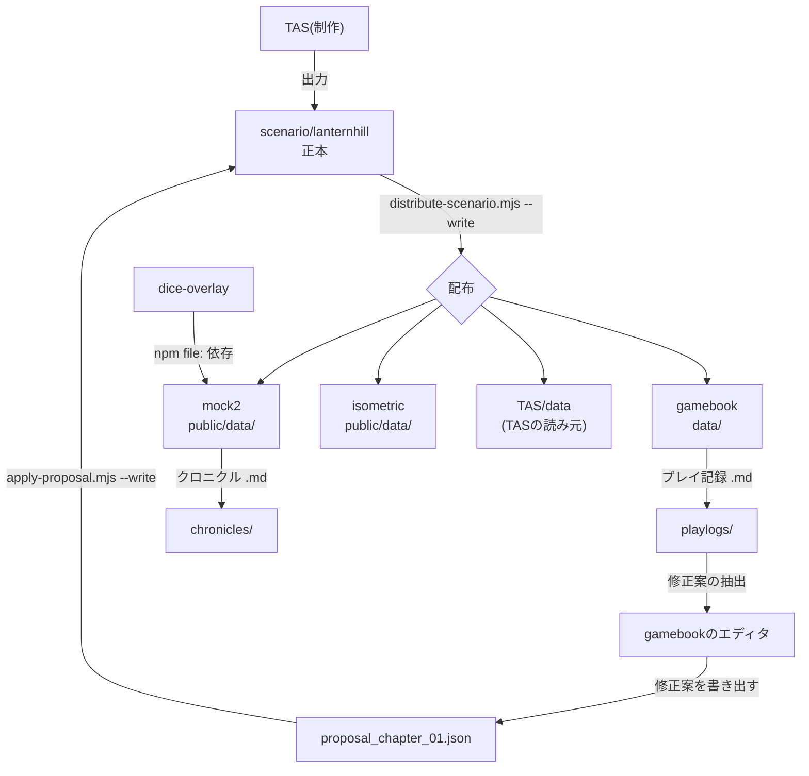

# パイプラインの現在地 — 2026-08-20

作者の構想を、**動いているコードで確認できた事実**として並べ直したもの。
「こうしたい」ではなく「今こうなっている」を書く。理想の構成は [SYSTEM_WORKFLOW.md](SYSTEM_WORKFLOW.md)(v1.0、2026-08-20時点で現状と乖離)にある。

---

## 1. 何を作っているのか(作者の言葉、2026-08-20)

1. **TASで作ったデータの、シナリオ進行が破綻しないことを、AIなしで人間が確認したい** → その確認場所がゲームブック
2. 確認できるようになったら、**テキスト・PDF・プロットをAIに処理させて、ゲームブックとして成立させたい**
3. そのシナリオに合う画像を生成できれば、**TASでのゲーム用データ作成もやりやすくなる**
4. いずれ、作っているソフトウェア群は**すべて繋がったパイプライン**になる

エディタが2つあるのは失敗ではなく、この流れ(1と2)の産物である。TASは制作、ゲームブックのエディタは**遊んでいて気づいた1行を直す場所**。

---

## 2. 実在するプログラム(2026-08-20 実測)

| # | 場所 | 役割 | 規模・性質 |
|---|---|---|---|
| 1 | `TAS/` | 制作スタジオ。AIに叩き台を生成させ、人が承認する。出力パイプラインが章とキャンペーンを組み立てる(`js/43-output-pipeline.js` に13段) | `js/` 52モジュール・約2,560行 |
| 2 | `scenario/lanternhill/` | **章データの正本**(2026-08-19決定)。`chapter_01.json` / `chapter_01.structure.json` / `campaign.json` | データのみ |
| 3 | `scripts/distribute-scenario.mjs` | 正本を各クライアントへ配る。既定はdry-run、`--write` で実行 | 配布先4か所 |
| 4 | `trpg-gamebook/` | **AIなしで進行の破綻を人が確認する場**。選択肢だけで最初から最後まで通せるか。ビルド無し・依存パッケージ無しのESM | `src/` 8ファイル |
| 5 | `trpg-gamebook/editor.html` | プレイ中に気づいた1行を直す小さなエディタ。AI取材(Gemini)とプレイ記録からの修正案あり | `editor.js` 244行 |
| 6 | `trpg-gm-mock2/` | LLM入りの本命プレイ画面。GM・同行者・戦闘・クロニクル | 検査 674件 |
| 7 | `trpg-gm-isometric/` | 別の見せ方の試作(サブモジュール) | 未計測 |
| 8 | `trpg-dice-overlay/` | 判定オーバーレイの共有部品。mock2 が `file:../trpg-dice-overlay` で依存 | 部品 |
| 9 | `trpg-rogue-map/` | 遠征モジュールの試作(村→迷宮→探索→物語→帰還) | 別ループ |

---

## 3. 今つながっている線(検証済み)

2026-08-20に実測した内容。

- 正本と配布先4か所の `chapter_01.json` は**sha1が一致**(`97f7878f…`)。配布は機能している
- 動いているgamebookサーバー(`serve.py 8123`)の応答も同じsha1。`no-store` なのでキャッシュも噛まない
- gamebookの検査 55件、mock2の検査 674件が現在の正本で通る
- `trpg-dice-overlay` の共有だけが、**部品レベルで実際に繋がっている唯一の線**

---

## 4. 切れている線 / 事故になる線(要対処)

| # | 状態 | 具体 | 影響 |
|---|---|---|---|
| A | **解決済み(2026-08-20)** | 論点1の案3で実装。エディタの `正本への修正案を書き出す` が差分だけを出し、`scripts/apply-proposal.mjs` が正本へ取り込む。`before` が食い違えば何も書かずに止まる | 構想1の環が閉じた。文字の直しに限る(照合キー・数値・増減は従来どおり丸ごと持ち帰り) |
| B | **黙って乗っ取る** | 下書きがあると、ゲーム本体は配布された最新版より下書きを優先する([`src/ui.js:322`](../trpg-gamebook/src/ui.js:322))。表示は章タイトルの「（下書き）」だけ | 2026-08-20に「データが古い」と見えた原因。正本を直しても届かない |
| C | **二重書き込み** | TASの「mock側へ出力」は配布先を直接上書きする。TASが古い章を読んでいると、配布済みの新版を旧版で潰す(`distribute-scenario.mjs` のコメントに明記) | 正本を1つにした効果が消える |
| D | **未着手** | 構想2(テキスト・PDF・プロット → ゲームブック)の入口。現状の `ai.js` は仕様範囲が「**1つの場面の secrets[] を会話で埋める**」まで([SPEC_ai_interview_v1](../trpg-gamebook/docs/SPEC_ai_interview_v1.md))。長文の取り込みは無い | 構想2はまだ設計前 |
| E | **古い設計図** | `SYSTEM_WORKFLOW.md` v1.0 に gamebook・rogue-map・正本の概念が無く、現存しない Print Package が載っている | 新しく参加する人(と未来の自分)が誤読する |

---

## 5. 未決の論点(答えが出れば設計が決まるもの)

**論点1: gamebookの編集の出口をどこへ繋ぐか**(Aの解) — **2026-08-20に案3で決定・実装済み**

| 案 | 内容 | 代償 |
|---|---|---|
| 1 | 書き出したJSONを人が正本へ取り込む(現状) | 環が閉じない。取り込み忘れで消える |
| 2 | ローカルの小さな保存APIを立て、エディタが正本へ直接書く | ブラウザからリポジトリを書ける状態を作ることになる |
| 3 | 差分だけを「提案ファイル」として出し、正本への取り込みはコマンドで行う | 一手増えるが、何が変わるかを見てから入れられる |

戻りやすさ: 案3 → 案2 は寄せられる。逆は難しい。

**論点2: 下書きの扱い**(Bの解)。ゲーム側は常に配布ファイルを読み、下書きは `editor.html` の中だけで有効にするか。あるいは下書きがある時に毎回どちらで遊ぶか訊くか。

**論点3: 正本への書き戻しの一本化**(Cの解)。TASの出力先を配布先ではなく**正本のみ**にして、その後 `distribute` を必ず通す形にできるか。

**論点4: 構想2の入口の形**。長文(テキスト・PDF)から作るのは「章の骨格」か「1場面ずつ」か。AI取材v1が1場面ずつで成立しているので、同じ粒度で広げるのが素直に見えるが未検証。

---

## 6. note記事にするなら

読み物になるのは構想そのものより、**同じ章データが5箇所に別内容で存在していた**という事故と、その解き方だと思われる。

- 5つのコピーが全部違い、同期する仕組みが1つも無かった(2026-08-19)
- 「どれを直したかで結果が変わる」ので、作者に**直した実感が残らない**
- 正本を1つ決め、残りを生成物と宣言し、配布をコマンドにした
- それでも今日「古い」と見えた。原因はファイルではなく、**ブラウザに残った下書きが最新版を黙って上書きしていた**こと(上のB)

AIに作らせる話ではなく、**AIに作らせたものを人が確認できる状態にする話**として書ける。

---

## 気づき(未確認・要判断)

`TAS/CLAUDE.md` と `trpg-gm-isometric/CLAUDE.md` の中身が、どちらも「BORGローカル設定」になっている。プロジェクト固有の作業ガイドとしては機能していない。意図的か事故か未確認(`TAS/CLAUDE.md` は未コミットの変更として残っている)。
