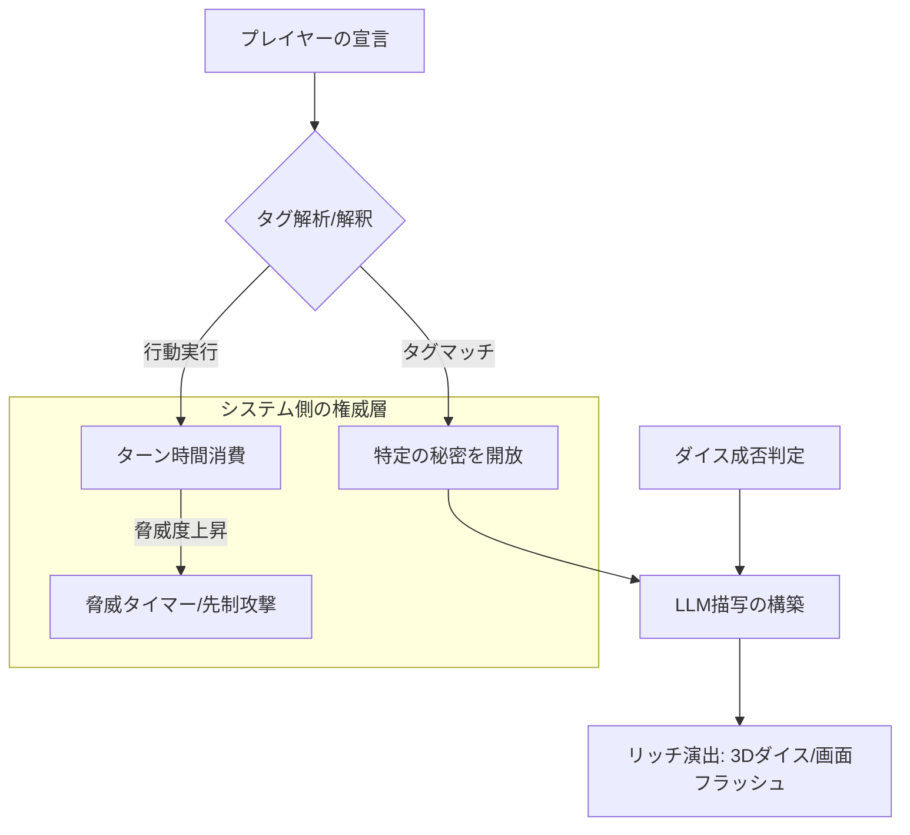

# ソロTRPG GMモック 改良提案書（GEMINI試案）

作成日: 2026-07-03  
提案者: Antigravity（ゲームデザイナー / 開発アシスタント）  
対象: LLMをGMとするソロTRPGモック（`trpg-gm-mock`）の品質・表現・ゲームプレイ体験の向上

---

## 0. 現状のアーキテクチャに対する評価
現在のモック（`index.html` および `server.js`）は、**「状態（HPや秘密情報）の管理をシステム（JS）側に置き、LLMには『解釈と描写』のみを任せる」**という大原則が非常にクリアに実装されています。これにより、LLMのパラメータ崩壊による「勝手な回復」「秘密の先出し漏洩」といった破綻が防がれており、製品化に向けて極めて筋の良いプロトタイプとなっています。

本提案（GEMINI試案）は、この堅牢なシステム基盤を活かしながら、**「ゲームとしての面白さ、手触りの良さ、プレイヤーのエージェンシー（自己決定感）」**を最大化し、商品レベルへと引き上げるための5つの具体的な改良アプローチです。

---

## 1. 5つの改良試案



### 1-1. 緊張感を生む「ターン経済（Time & Action Economy）」の導入
#### 【現状の課題】
敵はプレイヤーの判定失敗（ダイスの出目が目標値に届かない）時にしか行動・反撃しません。そのため、「時間をかけて念入りに調べる」ことに対するペナルティがなく、ゲームプレイが緩慢になりがちです。

#### 【改良試案】
* **「脅威タイマー（アペタイト・カウンター）」の導入**
  * プレイヤーが行動（移動、詳細調査、アイテム使用など）を1回行うたびに、システム内部のターン数（`state.turn`）が進むとともに、背後で「脅威レベル（Danger Level）」のゲージが蓄積します。
  * ゲージが最大になると、判定の成否に関わらず、敵の「先制攻撃」や「状況の悪化（天井が崩れ始める、ランタンの油が切れるなど）」が強制イベントとして発生します。
* **もたらされる効果**:
  プレイヤーは「無制限に部屋を調べる」ことができなくなります。「時間リソース」を意識させ、**「怪しい箇所は3つあるが、安全に調べられるのはあと1回だ。どれにする？」**という緊張感に満ちた葛藤を生み出します。

---

### 1-2. 意味ある探索「インテリジェント・タグ探索」
#### 【現状の課題】
判定に成功すると、事前に登録された秘密（`secrets`）が順番に開示される仕組みです。そのため、「レールを調べたのに、壁のお札の秘密がわかる」といった認知的解離が発生し得ます。

#### 【改良試案】
* **タグベースの情報解決**
  * プレイヤーの宣言テキストから、簡易なキーワード一致（例: `レール`, `札`, `匂い`）、もしくはLLM의 判定要求（`check` JSON）に `target` フィールド（例: `rail`）を設けて、何に対する調査かをシステム側で識別します。
  * システム側は、そのターゲットに対応した秘密（例: `#rail` に紐づく秘密）のみを開示します。
* **もたらされる効果**:
  プレイヤーの「どこに注目して宣言したか」という**意思決定（エージェンシー）がダイレクトに情報開示に結びつき**、「自分の観察眼によって謎を解いた」という強い納得感（アハ体験）を与えられます。

---

### 1-3. 安定した楽しさを保証する「セーフティ・ゲート進行」
#### 【現状の課題】
シーンの移行がLLMの `scene_complete` 判断のみに依存しているため、プレイヤーが意図した行動を取っても、LLMの気分次第で次のシーンへ進めず、同じ場所をループする「スタック（進行不能）」の懸念があります。

#### 【改良試案】
* **システム主導の「キーフラグ監視」**
  * システム側で各シーンの「クリア前提フラグ（例: シナリオの必須秘密を1つ以上開示、特定のアイテムを獲得）」を設定しておきます。
  * 条件が満たされたら、UI上に「奥へ進む」というシステム側のコマンドボタンを明確に出現させるか、プロンプトに `[SYSTEM] プレイヤーは次のエリアに進む条件を満たしました。ナレーションの最後で、次のエリアへ進むよう促してください` と指示を強制注入します。
* **もたらされる効果**:
  AIの気まぐれによる進行不能を防ぎつつ、ゲームとしての「ゴールへの道筋」を任天堂的な「見えない手すり」で優しくサポートできます。

---

### 1-4. 触覚と没入感を高める「リッチ・インタラクション＆演出」（UI/UX）
#### 【現状の課題】
テキストベースのチャットUIと、シンプルなデバッグ表示のみで構成されており、ビデオゲームとしての「手触りの良さ（Juice / クオリア）」が不足しています。

#### 【改良試案】
* **ダイスロールの演出強化**:
  * 判定時、ダイスの出目チップが表示されるだけでなく、CSS 3Dや簡易アニメーションで「画面上でダイスがゴロゴロと転がる」演出を入れます。
  * クリティカル（20）やファンブル（1）の発生時には、画面全体をフラッシュさせ、衝撃的な効果音（SE）や微振動（スクリーンシェイク）を発生させます。
* **インフォメーション・レイアウトの整理**:
  * 右側のデバッグパネルを「デバッグ」として置くのではなく、プレイヤーに見せる**「アドベンチャーシート（日誌）」**のように美しくリデザインします。
  * 開示された秘密は、古い羊皮紙にインクで追記されていくようなビジュアルで表現し、集めた証拠が並ぶ達成感を作ります。

---

### 1-5. Soloプレイをバディ体験に変える「AIコンパニオン（相棒システム）」
#### 【現状の課題】
ソロTRPGは議論相手がおらず、一本道の思考に陥りやすいため、「次に何をすればいいかわからない」状態になりがちです。

#### 【改良試案】
* **「同行者キャラクター」の追加**:
  * 例えば、「臆病だが目ざとい盗賊の少女・ピピ」を同行させます。
  * プロンプトにピピのキャラクター設定（②層知識: 行動方針や口調）を渡し、プレイヤーの宣言に対して「うわ、奥から変な音がしたよ、本当に進むの？」「私がそこを調べてあげようか？」といった掛け合いを発生させます。
  * プレイヤーが行動に迷ったとき、「ピピに相談する」というコマンドを用意し、AIに次のヒントを役になりきって喋らせます。
* **もたらされる効果**:
  「一人で画面に向かって文字を入力する寂しさ」を解消し、**「キャラクター同士の旅のドラマ」**へゲームの格を引き上げることができます。

---

## 2. 実装へのステップロードマップ

これらの改良案は、段階的に既存コードへ組み込むことが可能です。

```
【フェーズ 1: 安定性と手触りの向上】
  ├── セーフティ・ゲート（システム側での進行ボタンの実装）
  └── ダイスアニメーションとCSS効果による演出（Juice）の追加

【フェーズ 2: 探索ゲーム性の深化】
  ├── タグベースの秘密開示ロジックの導入（index.html の改修）
  └── ターン消費に応じた「脅威タイマー」の実装

【フェーズ 3: 表現の拡張】
  └── AIコンパニオン（バディ）プロンプトと対話UIの追加
```

本試案を出発点とし、どの項目からモックの拡張に着手するか、いつでもペアプログラミングでの実装をサポートいたします。
