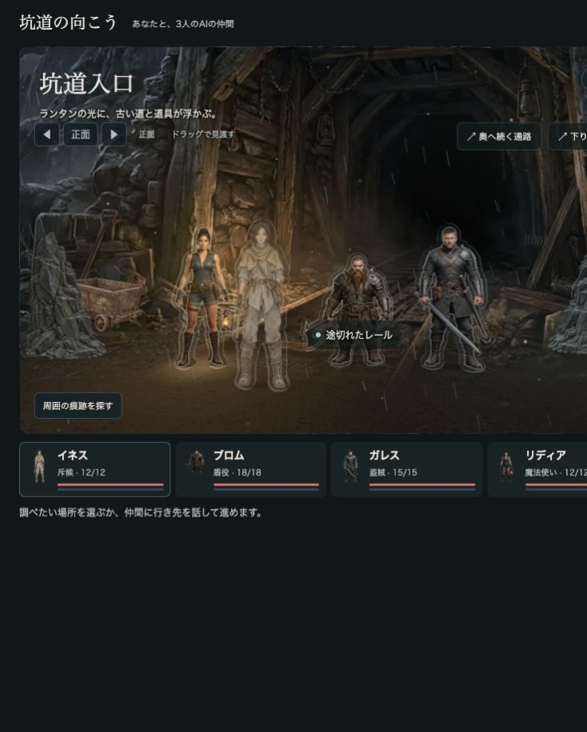
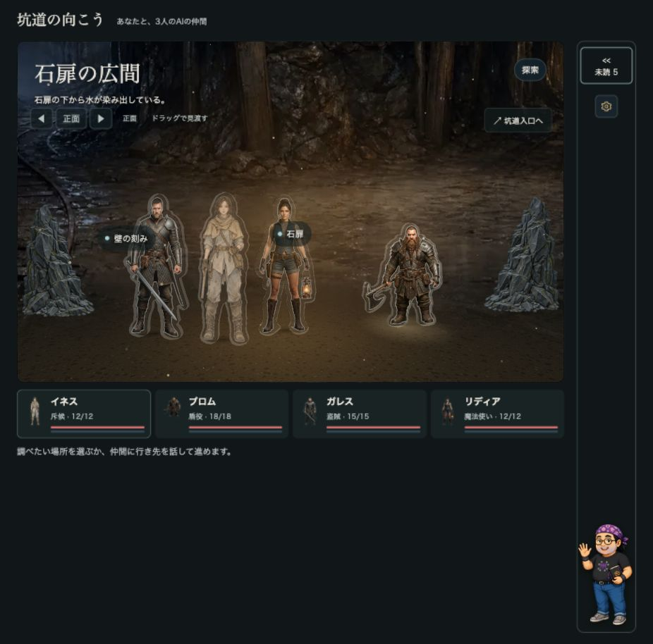
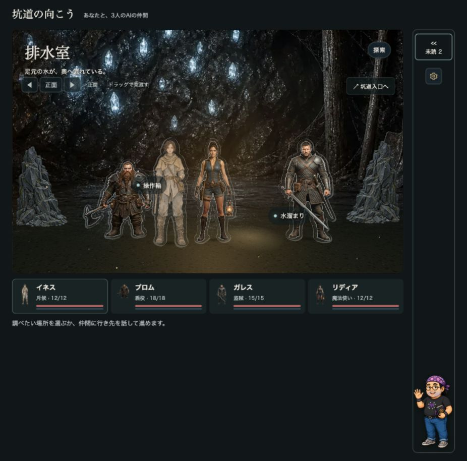

# プレイ画面の品質調整

## 確認範囲

- 実ブラウザーの入口・石扉の広間・排水室をクリックして確認。
- 4体の厚み付きGLBが読み込まれ、data-stage-standeesへ4人のIDを出力。素材読み込みエラーなし、ブラウザーのerrorログ0件。
- 926×914で舞台サイズ776×485pxを維持。人物の配置はシーンごとの抽選により変わります。
- 幅390×844で左20°から台車の調査パネルを開き、調査ボタンが表示されることを確認。横にはみ出さず、内容幅351pxの舞台を表示。
- 高さ320px／548.59pxの両方で台車・壁の刻み・蒼い塵の位置へ首振り20°で届くことをThreeの実投影で確認。
- 影は足裏と同じx・zに置く柔らかな接地影。光源に応じた動的な投影影は未実装。
- 背景画像は元の縦横比を維持。床の色・粗さをシーンごとに切り替え、奥の床は透明度の勾配で背景へなじませる。
- 左右の巨大な20×24の仮カキワリは撤去。前景岩の高さ7.5→4.8（36%減）、8.5→5.2（約39%減）。表示枠の端へ追従する配置。
- 台車画像は1536×1024 RGBA、完全透明画素41.9245%。画像下端の透明余白66pxを補正して接地。
- 戦闘の実プレイ、背面だけの目視、負荷測定は今回行っていません。テストの合格は見た目の良さの判定ではありません。





## 検査の生出力

### lighting-check.cjs

```text
{"characterHeightAt700px":{"before":407.29,"after":297.21},"depthWidth":{"before":4.5,"after":2.6},"horizonPercent":54}
PASS: 29 checks — 発言者追従 / 7秒後の消灯 / 手動照明 / 色・広がり / 不在の人物 / 暗闇の保護 / 再点灯 / 明るさ0 / シーン移動 / 入力状態の保護 / 人物縮小・消失点・首振り限界・狭い画面での調査 / スタンディー・足元の影・床の質感
```
### standee-check.cjs

```text
{"id":"ines","bytes":3222196,"meshes":3,"printedSurfaces":2,"plateThickness":0.04}
{"id":"brom","bytes":3707932,"meshes":3,"printedSurfaces":2,"plateThickness":0.04}
{"id":"gareth","bytes":4375992,"meshes":3,"printedSurfaces":2,"plateThickness":0.04}
{"id":"lydia","bytes":3684140,"meshes":3,"printedSurfaces":2,"plateThickness":0.04}
PASS: 24 checks — 実GLBの解析 / 表・裏・側面 / アクリル板の厚み / 有効な寸法
```
### ui-check.cjs

```text
PASS: 33 checks — 発見の重複整理・本人限定 / 未共有と共有済み / 現在の申し出・保留 / 古い申し出の除外 / 実結果の表示と会話形式維持 / 本人の情報共有 / 寄り絵の発見条件・状態保護 / 持ち物の画像・用途開示・所有追従
```
