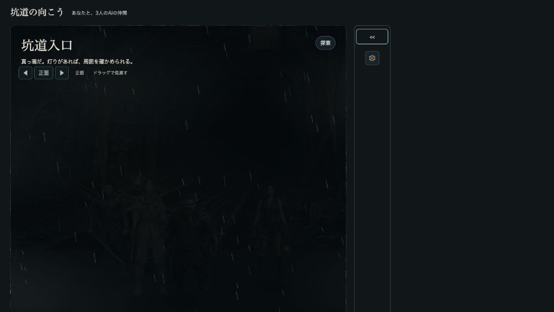
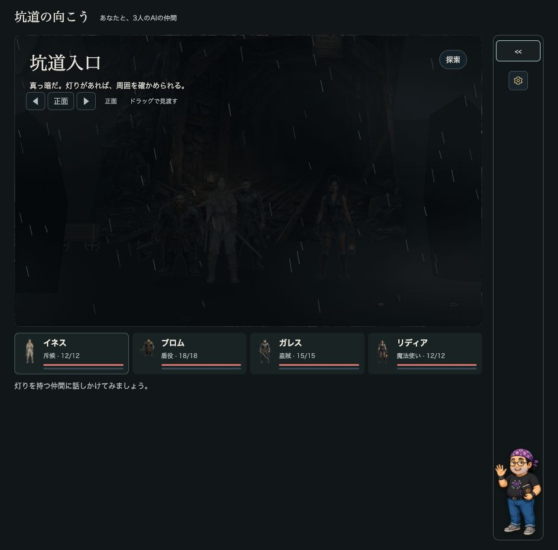
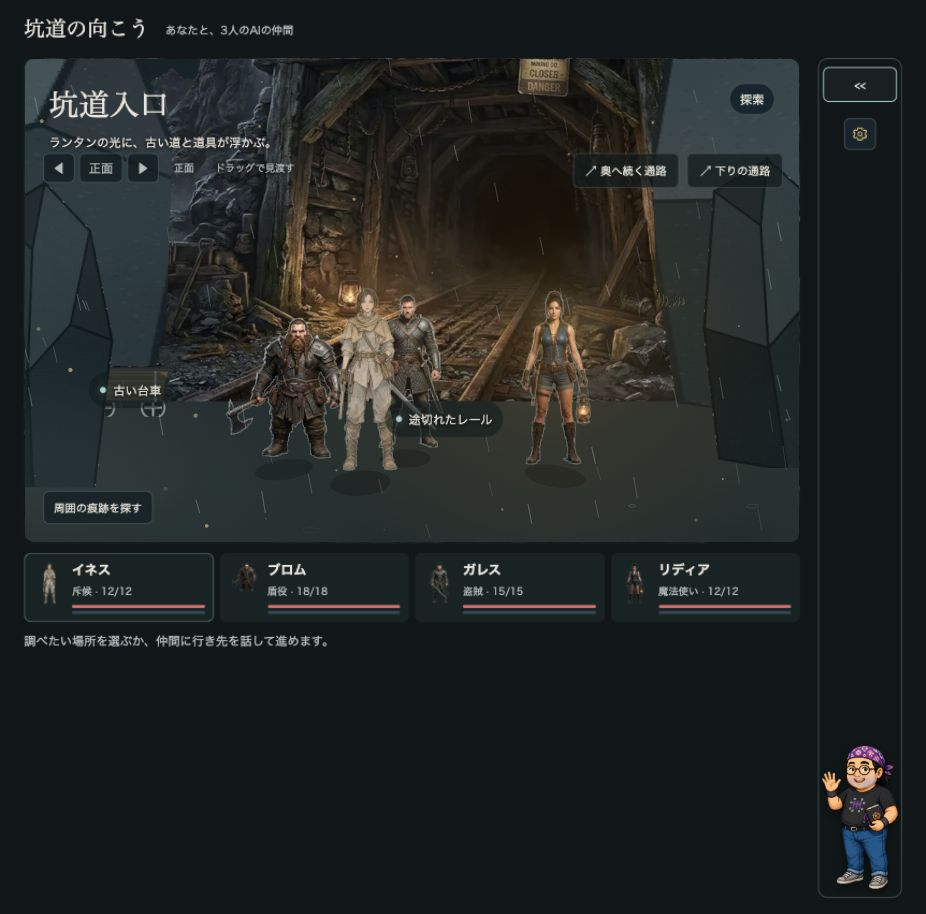

# 舞台表示枠の検証

変更前後は別の検証タブ・926×914・初期シーン・消灯・会話欄を畳んだ同一条件。

- 変更前：776 × 731.8125px
- 変更後：776 × 485px（高さ33.73%減）
- 会話欄を開く：518 × 323.75px
- 狭い画面の実測：内容幅351px、舞台高320px、ページ幅375px（横へのはみ出しなし）
- 横長比率2.00：776 × 388px。初期値へ戻す操作を確認。
- 台車の調査パネル：300 × 253.265625px、舞台の矩形内に表示。
- スマートフォン幅で左12°を向くと台車・レールが画面内に表示。
- 点灯は会話で実行。戦闘は実プレイしていません。





## 検査の生出力

```text
PASS: 33 checks — 発見の重複整理・本人限定 / 未共有と共有済み / 現在の申し出・保留 / 古い申し出の除外 / 実結果の表示と会話形式維持 / 本人の情報共有 / 寄り絵の発見条件・状態保護 / 持ち物の画像・用途開示・所有追従
{"characterHeightAt700px":{"before":407.29,"after":297.21},"depthWidth":{"before":4.5,"after":2.6},"horizonPercent":54}
PASS: 21 checks — 発言者追従 / 7秒後の消灯 / 手動照明 / 色・広がり / 不在の人物 / 暗闇の保護 / 再点灯 / 明るさ0 / シーン移動 / 入力状態の保護 / 人物縮小・消失点・首振り限界・狭い画面での調査
```

照明テストの人物サイズ比較値は既存カメラ調整の検査値で、今回のCSS枠の縮小率ではありません。
