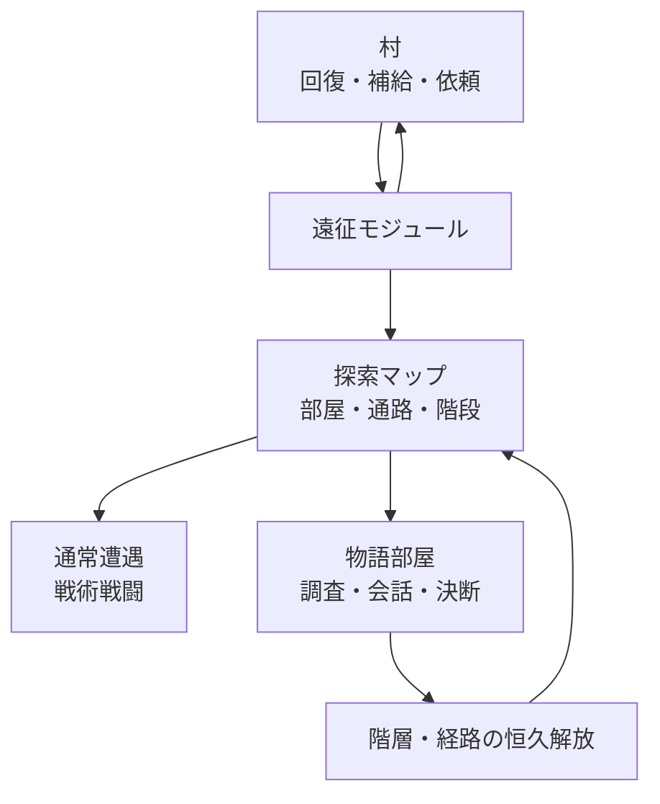
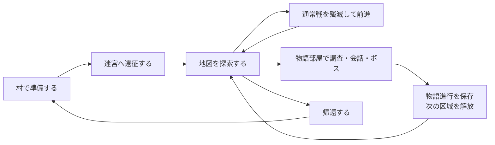
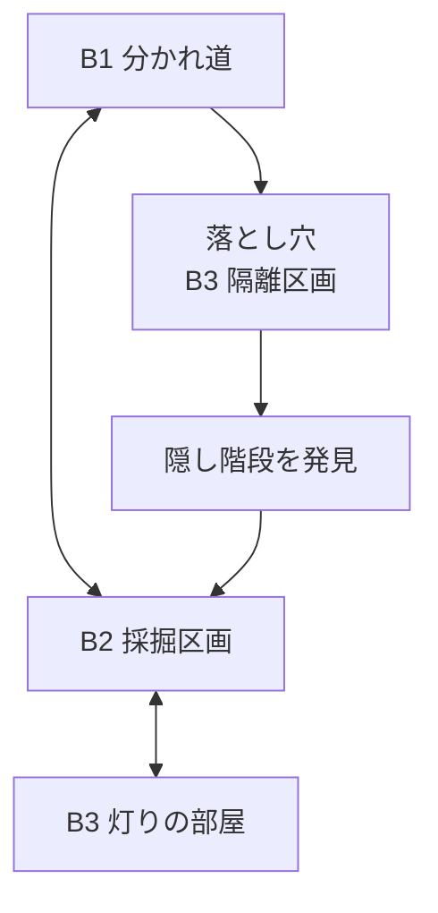
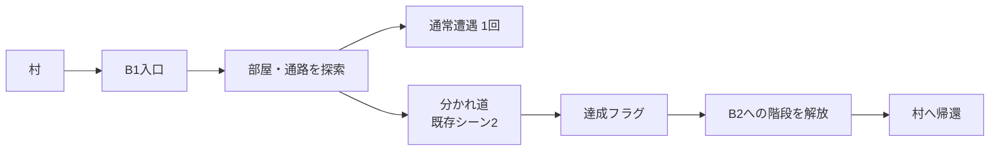

---
tags:
  - TRPG
  - ゲームブック
  - ローグライク
  - ウィザードリィ
  - アイソメトリック戦闘
  - 引き継ぎ
aliases:
  - 物語主導ダンジョン探索RPG構想
type: note
area: TRPG
sensitivity: normal
status: proposal
created: 2026-08-14
updated: 2026-08-14
---

# ゲームブック／ローグ／ウィザードリィ融合構想

## 結論

次に試作すべきものは、現行ゲームブックを直接作り替えることではない。作者が書く物語シーンと、既存のアイソメトリック戦闘を接続する、独立した**遠征モジュール**である。

目標は「完全自由TRPG」や「純粋なローグライク」ではなく、**物語主導のダンジョン探索RPG**である。ゲームブックを主役とし、ローグから未知の地図と経路選択を、ウィザードリィから階層探索・パーティ運用・帰還の緊張を借りる。



## この構想が生まれた背景

現行ゲームブックを初見でプレイすると、シーン間の位置関係が分かりにくいという問題があった。単なるシーン接続図ではなく、プレイヤーが「今どこにいて、どこへ潜り、どう帰るか」を理解できるローグ風の探索地図が必要である。

さらに、通常戦は敵を殲滅して前進する気持ちよさを持つ一方、強敵・ボスでは物語上で得た情報や地形を攻略に使う余地がほしい。この二つを接続すると、調査が「正解を知らないと進めない鍵」ではなく、戦い方を有利・鮮やかにする準備になる。

## 三つのゲームから借りる役割

| 起点 | このゲームで担う役割 | 主役にしないもの |
|---|---|---|
| ゲームブック | 作者が書く謎、人物、調査、決断、章の結末 | 場面を一直線に選ぶだけの進行 |
| ウィザードリィ | 階層、パーティ、深く潜る緊張、帰還の判断、戦術 | 大量の職業・呪文・数値管理を最初から持ち込むこと |
| ローグ | 未知の地図、部屋と通路、経路選択、偶発遭遇 | 永久死亡、毎回すべてが消えるランダム生成 |

## 基本ゲームループ



### 通常戦とボス戦の役割

| 種別 | 基本の勝利条件 | 物語との接続 |
|---|---|---|
| 通常戦 | 敵を殲滅し、短く前進する | 事前調査・道具で有利になる。調べなくても倒せる |
| 強敵 | 殲滅が基本だが、消耗差が大きい | 地形・弱点・装備で効率的に倒せる |
| ボス | 最終的には倒す。ただし戦略を選べる | 物語で得た事実が、攻略法・報酬・次章への影響を変える |
| 逃走戦 | 例外的な勝利条件 | 倒せない理由自体が物語上の意味を持つ |

通常戦まで毎回パズル化しない。テンポを守るため、通常戦は殲滅の快感を担い、複数戦略は強敵・ボスへ集中させる。

## 探索マップの方針

### 階層と階段

- 階段は原則として上下を往復可能にする。
- 下層ほど敵・報酬・物語の危険を強くする。
- シナリオの達成は、新階層または封鎖区画の恒久解放として扱う。
- 一方通行の落とし穴は、章ごとの特別な地形イベントとして使う。



落とし穴の先には、帰還経路・特別な情報・資源の少なくとも一つを保証する。損だけの一方通行にはしない。

### 生成と固定の境界

地図を毎回再抽選すると、プレイヤーが覚えた地理を奪う。したがって次のルールを採る。


- 区域へ初めて入るときに、seed付きで地図・敵・資源を生成する。
- 生成後は、帰還しても地図、撃破済み敵、取得済み資源、探索済み状態を維持する。
- シーン解放後も既知区域は変えず、新しく解放された区域だけを生成する。
- 通路遭遇は「未踏の通路に初めて入るとき」に最大一回だけ判定する。通行のたびに判定しない。

## 帰還

村への帰還は、遠征を中断するためではなく、次の遠征の準備をするために必要である。

- 村では回復、補給、依頼やNPC会話の更新を行う。
- 通常の帰還は、探索済みの階段・経路を歩いて戻る。
- 深層からの非常帰還は、一遠征に一回の消耗品または魔法とする。
- 帰還で地図や物語進行を失わない。

帰還手段を無制限にすると、地図と帰路の意味が消える。一遠征一回の限定手段は、「今すぐ帰るか、さらに潜るか」の判断を作る。

## 戦利品とハスクラの扱い

ハスクラは採用候補だが、最初から「攻撃力が少し違う同名装備を厳選する」形式にはしない。物語・地図・戦術を変える固有効果のある戦利品を中心にする。

| 例 | 変わること |
|---|---|
| 坑夫の鉤爪 | 崩落地帯を越え、隠し通路へ進める |
| 燐光のランタン | 暗所の待ち伏せを防ぐが、光を嫌う敵を誘う |
| 鉄杭とロープ | 落とし穴を往復可能な近道に変える |
| 磁鉄の盾 | 金属系の敵を押し返し、狭い通路で有利になる |
| 帰還の石 | 深層から遠征を終える一回限りの手段 |

ランダム性能の装備、装備厳選、クラフトは、遠征の手触りを検証してから考える。現行の所持品処理は鍵・弱点・単一の回復品向けであり、本格ハスクラの装備・スタック管理は未実装である。

## 既存資産と欠けているもの

| 層 | 状態 | 根拠 |
|---|---|---|
| ゲームブック | あり | `trpg-gamebook`には、場面、調査、出口条件、所持品、検査、自動プレイがある |
| アイソメトリック戦闘 | 試作あり | `trpg-gm-isometric`には、グリッド、移動、位置、障害物、近接戦闘、固定舞台がある |
| 遠征・探索 | 未実装 | 階層地図、部屋・通路、階段、探索状態、帰還はない |
| 通路の通常遭遇 | 未実装 | 遠征マップと戦闘を結ぶ契約がない |
| ハスクラ | 未実装 | 固有装備、複数個所持、装備・スタック・鑑定の状態モデルがない |

既存のアイソメトリック側には、`barrier`、`collapse`、`ambush`のような意味的な配置役割を持つ固定舞台がある。新しい探索層は「物語上の木柵を置くべき部屋を選ぶ」までを担当し、部屋の中の配置・演出・戦闘は既存の舞台テンプレートへ委ねる方向が有望である。

## 最初の試作：B1遠征

現行ゲームブックを改修せず、独立した遠征コアで『廃坑の灯』のB1だけを試す。



### 試作に入れるもの

1. 入口、5〜7部屋、通路、上り階段、下り階段候補を持つB1地図。
2. 必ず到達可能な物語部屋「分かれ道」。
3. 未踏通路で一回だけ起きる通常遭遇。
4. 「分かれ道」を達成するまで使えないB2への階段。
5. 村へ戻る操作と、地図・探索状態を維持した再開。
6. 最初は2Dのローグ風表示。物語部屋はゲームブック、遭遇は既存戦闘を呼ぶ。

### 試作に入れないもの

- 職業、レベル、大量の呪文
- ランダム性能の装備厳選
- クラフト、複雑な経済、永久死亡
- 空腹、松明残量などの細かいターン消費
- 遠征用エディタ
- B2以降の実装

### 作者が手で書く最小データ

作者が地図の全マスを手書きする必要はない。必須地点だけを書く。

```js
{
  floorId: "mine_b1",
  roomCount: [5, 7],
  anchors: [
    { id: "entrance", type: "start" },
    { id: "junction", type: "story", sceneId: 2 },
    { id: "downstairs", type: "stairs", unlocksAfter: "junction" }
  ]
}
```

生成器は、部屋と通路を作り、必須地点を到達可能な位置へ置く。物語の順序は作者が管理し、地図の余白だけが探索ごとに変わる。

## 試作の検査条件

コードの単体テストだけで終わらせない。実画面で「移動→物語→解放→帰還」を通す。

- 100個のseedすべてで、入口から分かれ道と階段候補へ到達できる。
- 分かれ道の達成前に下り階段を使えない。
- 達成後に下り階段を使える。
- 帰還後に再開しても、地図・探索済み状態・撃破済み遭遇が一致する。
- 未踏通路の通常遭遇は一回だけ発生する。
- ブラウザ上で、地図を見て初見でも現在地・戻り道・新しい階段を判断できる。

## 決定済み

- ゲームブックを物語の主役として残す。
- 階層つきローグ風探索マップと、村への帰還を加える。
- 階段は原則として上下を往復可能にする。
- 物語シーン達成は、新階層または封鎖区画の恒久解放にする。
- 地図・敵・資源は、区域の初回生成後は固定する。既知区域は再生成しない。
- 通常戦は殲滅を標準の勝利条件にする。複数戦略は強敵・ボスに集中させる。
- ハスクラを入れる場合は、数値厳選より地図・物語・戦術を変える固有効果を優先する。

## 未決事項

- 現行ゲームブックとアイソメトリック試作を、どのリポジトリ／新規プロジェクトで接続するか。
- パーティを最初から複数人にするか、1人＋同行者の軽い構成で試すか。
- ボスの戦略差を、消耗差だけにするか、報酬・次章展開まで変えるか。
- ハスクラをいつ導入するか。B1縦切りでは導入しない。
- 新区域を初回生成した後、未知の地図をどうプレイヤーに見せるか（完全な霧か、隣接部屋を`?`で示すか）。

## 実装の分担と検証責任

### 分担


- **Claude**: B1遠征の実装主担当。地図生成、保存、既存ゲームブック／戦闘との接続、実ブラウザでの動作確認、修正までを一貫して担当する。
- **Codex**: ゲーム性の設計、仕様を小さな縦切りへ絞ること、データ契約とテスト観点のレビュー、実装差分の批評を担当する。
- **作者**: 作品としての最終判断と、短い実プレイを行う。複数テスターの確保は前提にしない。

同じファイルをClaudeとCodexが並行して実装しない。Codexがコードを書く場合も、契約が固まり、Claudeから切り出された限定作業に留める。

### 完了条件

前回、`npm test`とビルドが通っていても、Chronicle書き出しボタンが実際にはクリック不能だった。したがって、B1遠征では非ブラウザテストの成功だけを完了条件にしない。

実装完了時には、実ブラウザで次を一続きに確認する。

1. 村からB1へ入る。
2. 地図上を移動し、未踏通路の通常遭遇を一度だけ解決する。
3. 分かれ道の物語シーンを完了する。
4. B2への階段が解放される。
5. 村へ帰還する。
6. 再開後、同じ地図・探索済み状態・撃破済み遭遇が維持される。

クリック不能、重なり順、画面遷移、保存復元を含めて確認し、操作結果または画面証跡を残す。これはUIだけの確認ではなく、遠征のプレイ可能性を判定するための受入条件である。

## 次に行うこと

1. B1遠征試作を置く独立プロジェクトの場所と、既存ゲームブック／isometric資産の取り込み方を決める。
2. 遠征モジュールの最小データ契約を確定する。
3. seed付きB1生成器と到達可能性検査だけを先に作る。
4. 2D探索地図を作り、作者本人が「初見で位置関係を把握できるか」を試す。
5. 物語部屋、通常遭遇、帰還の順で接続する。

## 補足：過去の方針との関係

現行TAS/mock2を保全し、直接の大規模改修を避ける方針とは衝突しない。本構想は、現在のゲームブックとisometric戦闘の再利用可能な部分を使う別の試作である。既存版を壊さず、遠征モジュールが面白いと確認できた要素だけを後から採用する。
